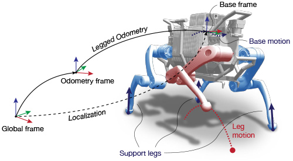
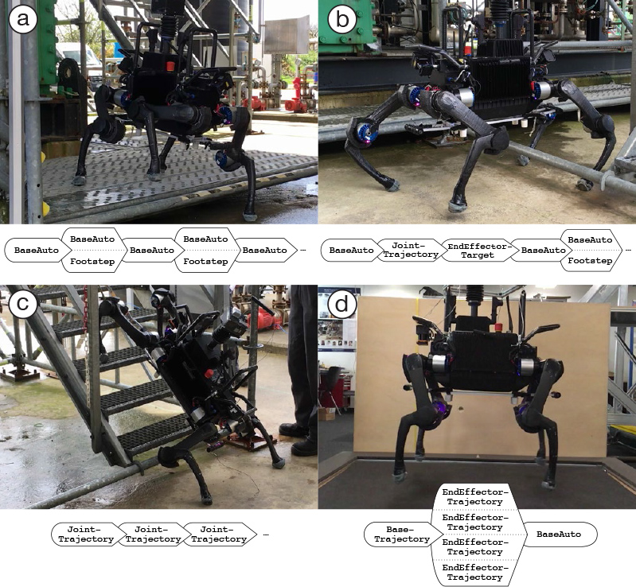
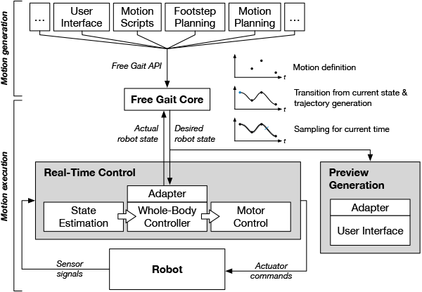

# Free Gait

**An Architecture for the Versatile Control of Legged Robots**

*Free Gait* is a software framework for the versatile, robust, and task-oriented control of legged robots. The Free Gait interface defines a *whole-body abstraction layer* to accommodate a variety of task-space control commands such as end effector, joint, and base motions. The defined motion tasks are tracked with a feedback whole-body controller to ensure accurate and robust motion execution even under slip and external disturbances. The application of this framework includes intuitive tele-operation of the robot, efficient scripting of behaviors, and fully autonomous operation with motion and footstep planners.

The source code is released under a [BSD 3-Clause license](LICENSE).

**Author: Péter Fankhauser 
Maintainer: Péter Fankhauser, pfankhauser@ethz.ch 
With contributions by: Samuel Bachmann, Dario Bellicoso, Thomas Bi, Remo Diethelm, Christian Gehring 
Affiliation: Robotic Systems Lab, ETH Zurich**

## Publications

If you use this work in an academic context, please cite the following publication(s):

* P. Fankhauser, D. Bellicoso, C. Gehring, R. Dubé, A. Gawel, M. Hutter,
**"Free Gait – An Architecture for the Versatile Control of Legged Robots"**,
in IEEE-RAS International Conference on Humanoid Robots, 2016. ([PDF](https://www.researchgate.net/publication/312111333))

        @inproceedings{Fankhauser2016FreeGait,
            author = {Fankhauser, P{\'{e}}ter and Bellicoso, C. Dario and Gehring, Christian and Dub{\'{e}}, Renaud and Gawel, Abel and Hutter, Marco},
            booktitle = {IEEE-RAS International Conference on Humanoid Robots},
            title = {{Free Gait – An Architecture for the Versatile Control of Legged Robots}},
            year = {2016},
        }

## Unit Tests

	catkin build free_gait_core --no-deps --verbose --catkin-make-args run_tests

## Overview

## Usage

### Free Gait Actions

Free Gait actions are libraries and scripts that define motions using the Free Gait API (for ROS ). For ROS, these actions can be write in any language with a ROS client library using the message and action definitions in [`free_gait_msgs`]. For C++, Free Gait provides the [`free_gait_core`] library to work with motion definitions and the [`free_gait_ros`] for interfacing ROS. To work with Python, use the [`free_gait_python`] library. For simple motion definitions, Free Gait supports actions defined in [YAML] format. For more information about using YAML actions, refer to [YAML Scripting Interface](#YAML-Scripting-Interface).

Free Gait actions can be either launched manually or with help of the [`free_gait_action_loader`].

### Free Gait Action Loader

The [`free_gait_action_loader`] allows to launch actions through a [ROS service](free_gait_msgs/srv/SendAction.srv) or [ROS action](free_gait_msgs/action/ExecuteAction.action). Currently, the action loader supports *YAML* motion definitions, *Python* scripts, and starting *ROS launch files* for *C++* and other libraries.

Run the [`free_gait_action_loader`] with
	
	rosrun free_gait_action_loader action_loader.py

The [`free_gait_action_loader`] manages the actions and makes sure that only one action is running at the time. To register an action with the [`free_gait_action_loader`], one has to load the action as a ROS plugin.

### RQT Free Gait Action

The [`rqt_free_gait_action`] packages provides a [rqt](http://wiki.ros.org/rqt) user interface to the  [`free_gait_action_loader`]. The interface shows the actions organized in *collections* and allows to preview and send the actions.

 

### RQT Free Gait Monitor

Once actions are being executed by the [Free Gait action server](free_gait_ros/include/free_gait_ros/FreeGaitActionServer.hpp), the [rqt_free_gait_monitor] shows the progress of the execution and allows to pause and stop the action.

### Free Gait RViz Plugin

### YAML Scripting Interface

## FAQ

### Actions Are Not Found

If no Free Gait actions are found/loaded, this service call will return empty:

	rosservice call /free_gait_action_loader/list_actions "collection_id: ''"

In this case, try [initializing rosdep](http://wiki.ros.org/rosdep#Initializing_rosdep) with:

	sudo rosdep init
	rosdep update

[ROS]: http://www.ros.org
[RViz]: http://wiki.ros.org/rviz
[YAML]: http://yaml.org
[free_gait_core]: free_gait_core
[free_gait_ros]: free_gait_ros
[free_gait_python]: free_gait_python
[free_gait_msgs]: free_gait_msgs
[free_gait_action_loader]: free_gait_action_loader
[rqt_free_gait_action]: rqt_free_gait_action
[rqt_free_gait_monitor]: rqt_free_gait_monitor

.float_right {
    float: right;
}
